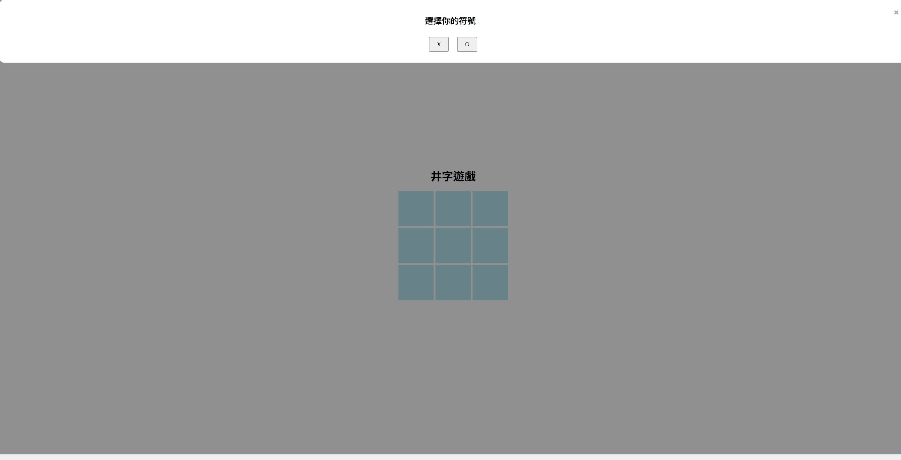
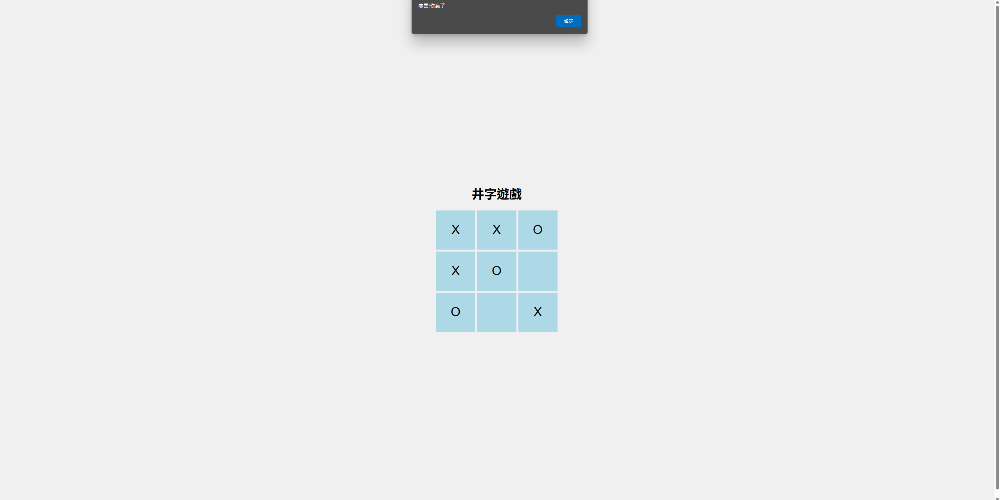
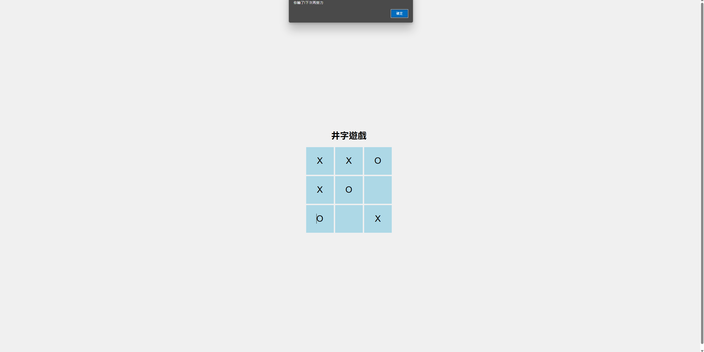
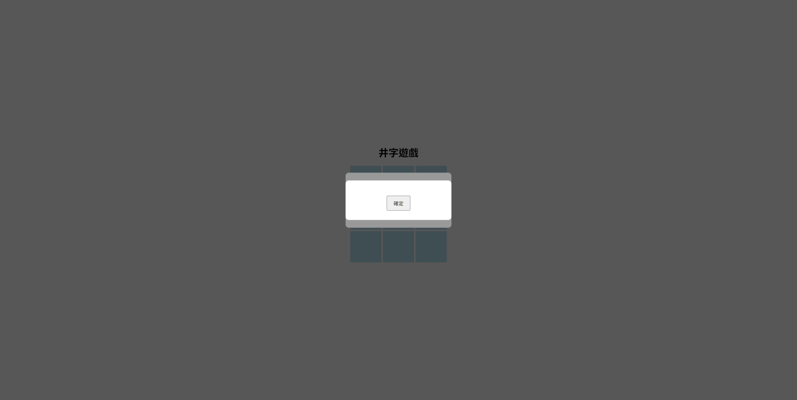
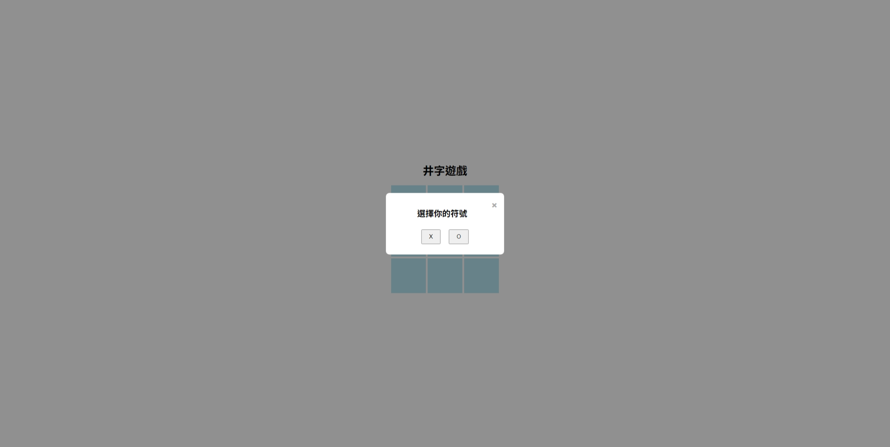
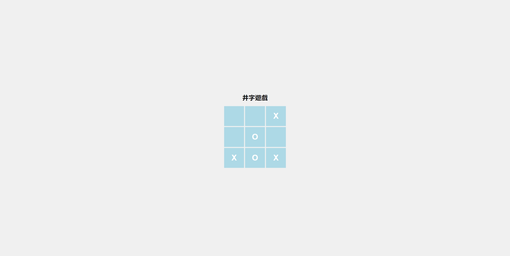
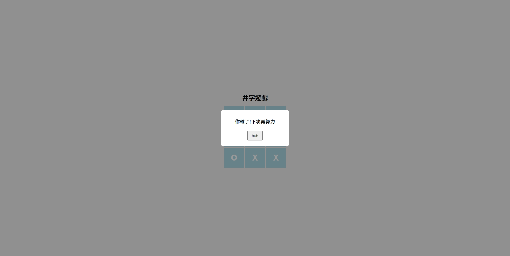
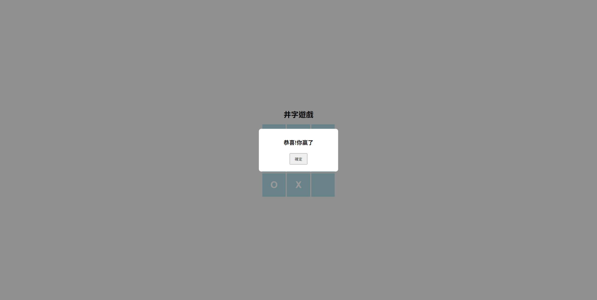

## Prompt 1
使用javascript, html5, css 設計一個玩家與程式互動的網頁井字遊戲。
以下為行為需求：
執行網頁井字遊戲後、立即以彈跳視窗及按鈕方式讓玩家選擇X or O 作為代表符號，彈跳視窗的需要有"選擇你的符號" 內容的標頭和一個取消的X 按鈕，下方會有兩個選擇按鈕 X 和 O 為選擇的符號
每一局開始時，玩家或電腦畫第一個格子的先後順序(亦即那一位先畫格子)為隨機決定，不可固定。
玩家與電腦必須以交互方式畫格子，以畫過的格子，不得重複畫。遊戲過程的畫面需要有九宮格，格子顏色為淺藍色，且框線顏色和背景一樣，選擇的格子上面要顯示符號，符號是實心線條，顏色要和背景一樣
每次玩家級電腦畫完格子後，程式需立即判斷玩家贏、玩家輸或遊戲尚未結束。若是玩家贏，則利用彈跳視窗輸出 "恭喜!你贏了"的訊息，並立即進入下一局遊戲; 若是玩家輸了，則利用彈跳視窗輸出 " 你輸了!下次再努力" 的訊息，並立即進入下一局遊戲; 若是輸贏尚未決定，並且尚有格子沒畫完，則繼續遊戲。
若是所有格子皆被玩家或電腦所畫，且不分輸贏，則利用彈跳視窗輸出" 這局平手!" 的訊息，並開始下一局遊戲， 給我符合以上需求的所有程式碼
### 成果

bug: 彈出視窗太寬且沒置中，應該要讓他置中，並且讓他不要太寬

bug: 贏的瞬間電腦還是會繼續畫下一步才跳出視窗，應該要讓他在贏的瞬間就跳出視窗。還有贏的通知訊息不是要使用alert，而是要使用自訂義的彈跳視窗，還有畫格子的時候符號應該要和背景一樣是白色的，且符號要在粗一點點

bug: 如果這局贏了，按下彈出的視窗確認後，會馬上跳出我輸了的視窗

## Prompt 2
有幾個bug：
彈出視窗太寬且沒置中，應該要讓他置中，並且讓他不要太寬。
贏的瞬間電腦還是會繼續畫下一步才跳出視窗，應該要讓他在贏的瞬間就跳出視窗。還有贏的通知訊息不是要使用alert，而是要使用自訂義的彈跳視窗，還有畫格子的時候符號應該要和背景一樣是白色的，且符號要在粗一點點。
如果這局贏了，按下彈出的視窗確認後，會馬上跳出我輸了的視窗。
修正以上bug並重新給我所有的程式碼
### 成果

bug: 一開始談出的選擇視窗樣式錯誤，看不到任何的文字和符號按鈕還有取消的叉叉按鈕，只有中間的確認字樣的按鈕

## Prompt 3
一開始彈出的符號選擇視窗樣式錯誤，看不到任何的文字和符號按鈕還有取消的叉叉按鈕，會有另一個彈出視窗擋在前面上面顯示確認的按鈕，按下去後所有彈出視窗都消失，並無法做任何操作了，修正此錯誤並給我完整的程式碼
### 成果
完成所有需求

