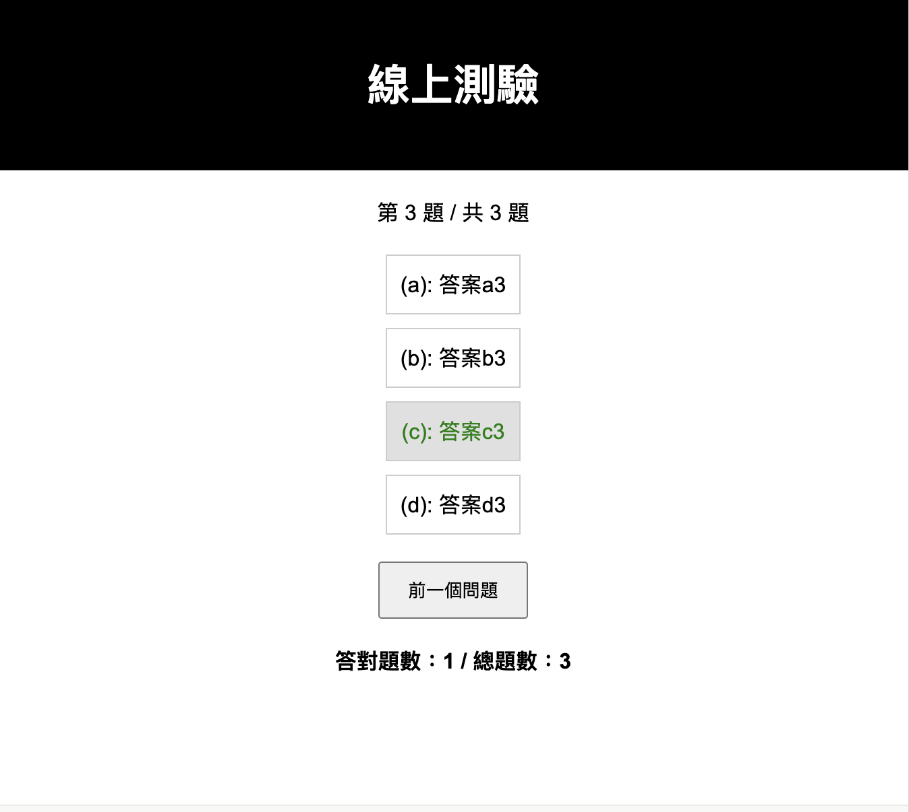
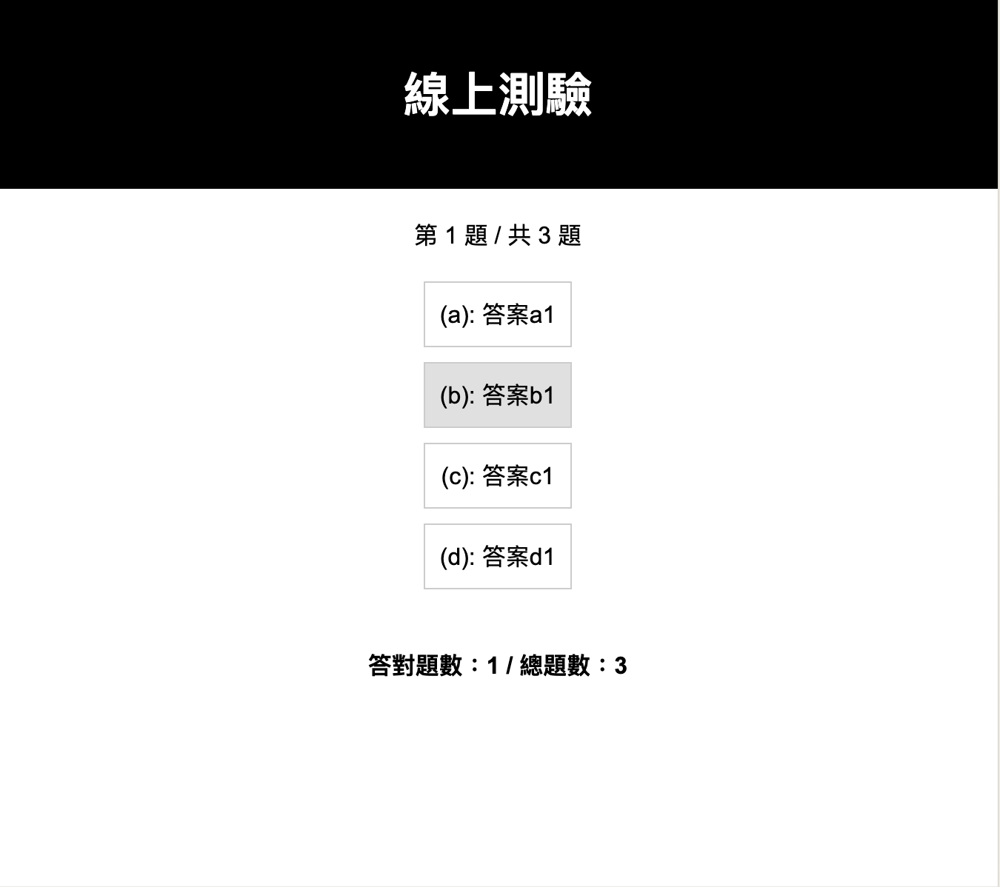
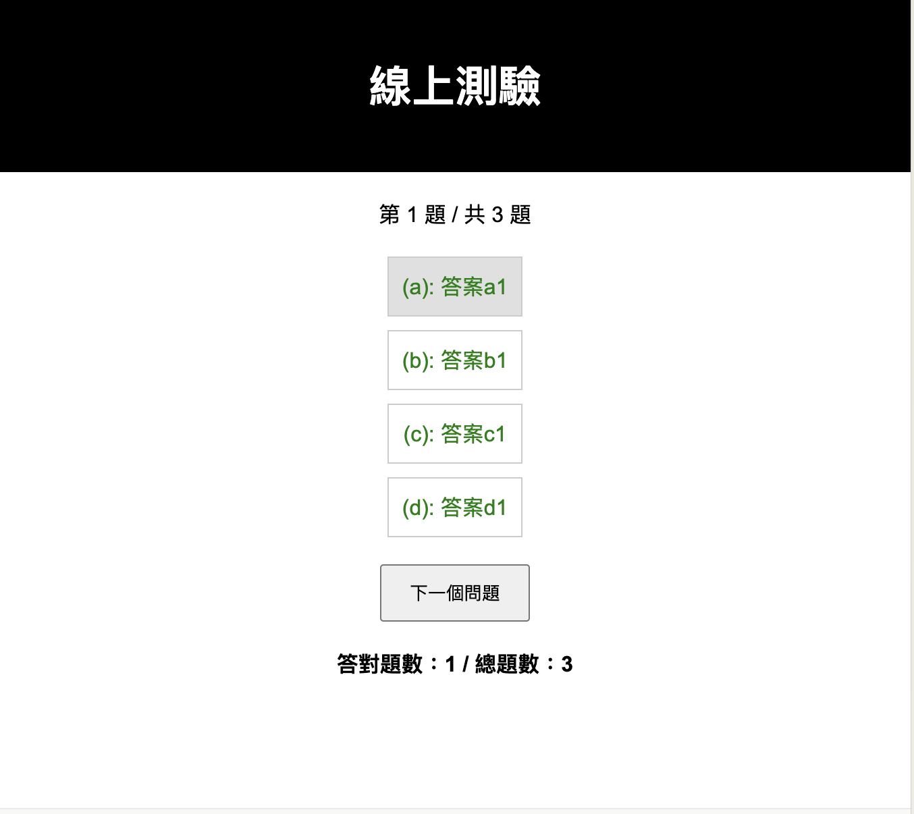
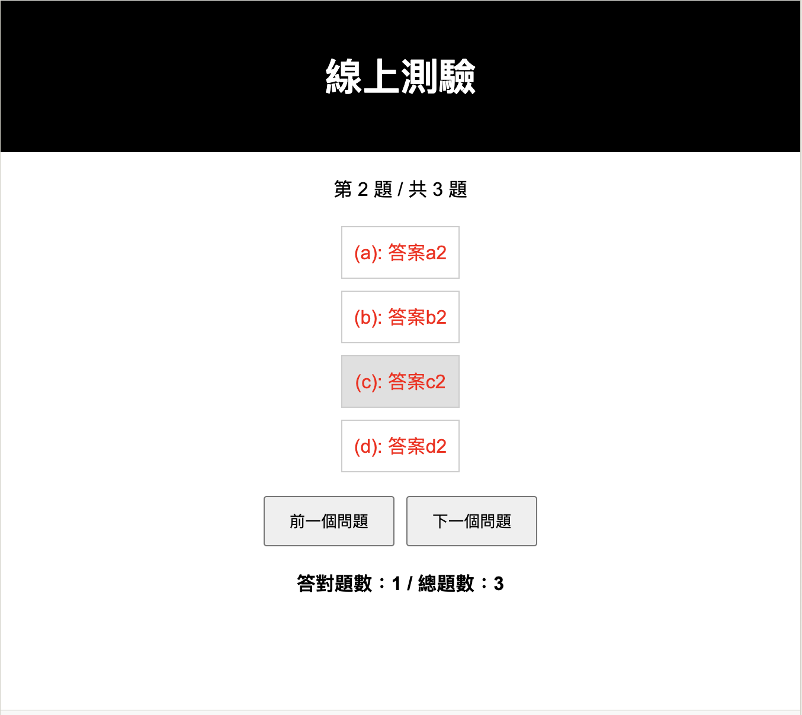

# Generate Website with Claude 3.5

## Prompt 1
請幫我製作一個線上測驗網頁，並完成以下功能，需要附上完成程式碼。(包括 html, css, js)
具體功能如下：
1. 畫面最上方有"線上測驗"標題，請以黑底白字呈現。
2. 畫面副標題為現在題數，總題數有三題。
3. 接下來有四個選項(a~d)，分別顯示"((a~d)：答案(a~d){現在題號})"，所有題目皆為單選題，只有一個答案正確，每個選項各佔一行。
4. 最後，畫面最下方有兩個按鈕。分別為"前一個問題"、"下一個問題"(如果沒有則不顯示)。
   如果為最後一題，則顯示"送出測驗"按鈕。
5. 輸入答案之後，可按下"下一個問題"按鈕，進入下一題。
6. 如果按"前一個問題"按鈕，可以回到上一題，並更改答案。
7. 如果到第二題之後，按下"下一個問題"，則會到第三題，但是答案的選項還是黑色的，而且還沒有顯示答對題數與總題數。
8. 最後，按下"送出測驗"，則會在最下面顯示「答對題數」與「總題數」。
9. 送出測驗後，可以檢視之前的回答。
   答錯的題目與選項呈現紅字；答對的題目與選項則會呈現綠字。
10. 所有內容皆為置中對齊

### 成果

bug: 答對的題目應該全部變為綠色


bug: 送出測驗後題目沒有變色，並且無法回到下一題

## Prompt 2
在送出測驗後，需要可以多次往返上一題與下一題。並且答對的題目整題選項變成綠色，答錯的題目整題變成紅色。

### 成果
順利完成所有需求




## Prompt 3
我現在要做自動化測試，需要在html tag中加入"aria-label"與"data-testid"屬性，請幫我完成並給我全部的程式碼

### 成果
順利完成所有需求
```html
<body>
    <div class="header">
        <h1 aria-label="線上測驗標題" data-testid="quiz-title">線上測驗</h1>
    </div>
    <div class="question-count" aria-label="題目計數" data-testid="question-count"></div>
    <div class="options" aria-label="答案選項" data-testid="answer-options"></div>
    <div class="buttons">
        <button id="prevBtn" aria-label="前一個問題" data-testid="prev-button" style="display: none;">前一個問題</button>
        <button id="nextBtn" aria-label="下一個問題" data-testid="next-button">下一個問題</button>
    </div>
    <div class="result" aria-label="測驗結果" data-testid="quiz-result" style="display: none;"></div>

    <script src="script.js"></script>
</body>
```

# Generate test script with Claude 3.5

## Prompt 1
這是一個線上測驗網頁（包括html, css, js），我想要使用"Playwright"進行端對端測試，幫我使用Typescirpt生成測試腳本，並給我完整的程式碼。
在html tag中含有"aria-label"與"data-testid"屬性，請盡量用"getByTestId"進行選擇，並註明現在的測試對象為何。

## Prompt 2
程式碼大致正確，只有在'Correct and incorrect answers are highlighted'中，測試答案的顏色錯誤。
在提交測驗後，畫面會停留在第三題，應該要回上一題檢查答案顏色。

### 成果
順利完成所有需求
```ts
import { test, expect } from '@playwright/test';

test.describe('Online Quiz E2E Tests', () => {
  test.beforeEach(async ({ page }) => {
    // 導航到測驗頁面
    await page.goto('/');
  });

  test('Quiz title is visible', async ({ page }) => {
    // 測試對象: 標題
    const title = page.getByTestId('quiz-title');
    await expect(title).toBeVisible();
    await expect(title).toHaveText('線上測驗');
  });

  test('Navigate through questions', async ({ page }) => {
    // 測試對象: 問題計數器
    const questionCount = page.getByTestId('question-count');
    await expect(questionCount).toHaveText('第 1 題 / 共 3 題');

    // 測試對象: 下一題按鈕
    const nextButton = page.getByTestId('next-button');
    await nextButton.click();
    await expect(questionCount).toHaveText('第 2 題 / 共 3 題');

    await nextButton.click();
    await expect(questionCount).toHaveText('第 3 題 / 共 3 題');

    // 測試對象: 前一題按鈕
    const prevButton = page.getByRole('button', { name: '前一個問題' });
    await prevButton.click();
    await expect(questionCount).toHaveText('第 2 題 / 共 3 題');
  });

  test('Select answers and submit quiz', async ({ page }) => {
    // 測試對象: 答案選項
    await page.getByTestId('option-a').click();
    await page.getByTestId('next-button').click();

    await page.getByTestId('option-b').click();
    await page.getByTestId('next-button').click();

    await page.getByTestId('option-c').click();

    // 測試對象: 送出按鈕
    const submitButton = page.getByTestId('submit-button');
    await submitButton.click();

    // 測試對象: 測驗結果
    const result = page.getByTestId('quiz-result');
    await expect(result).toBeVisible();
    await expect(result).toHaveText('答對題數：3 / 總題數：3');
  });

  test('Correct and incorrect answers are highlighted', async ({ page }) => {
    // 選擇答案
    await page.getByTestId('option-a').click();  // 正確答案
    await page.getByTestId('next-button').click();

    await page.getByTestId('option-a').click();  // 錯誤答案 (正確答案是 b)
    await page.getByTestId('next-button').click();

    await page.getByTestId('option-c').click();  // 正確答案

    // 提交測驗
    await page.getByTestId('submit-button').click();

    // 測試對象: 答案選項的顏色
    // 檢查第三題 (當前頁面)
    await expect(page.locator('.options')).toHaveClass(/correct-question/);
    
    // 檢查第二題
    await page.getByRole('button', { name: '前一個問題' }).click();
    await expect(page.locator('.options')).toHaveClass(/incorrect-question/);
    
    // 檢查第一題
    await page.getByRole('button', { name: '前一個問題' }).click();
    await expect(page.locator('.options')).toHaveClass(/correct-question/);
  });
});
```
