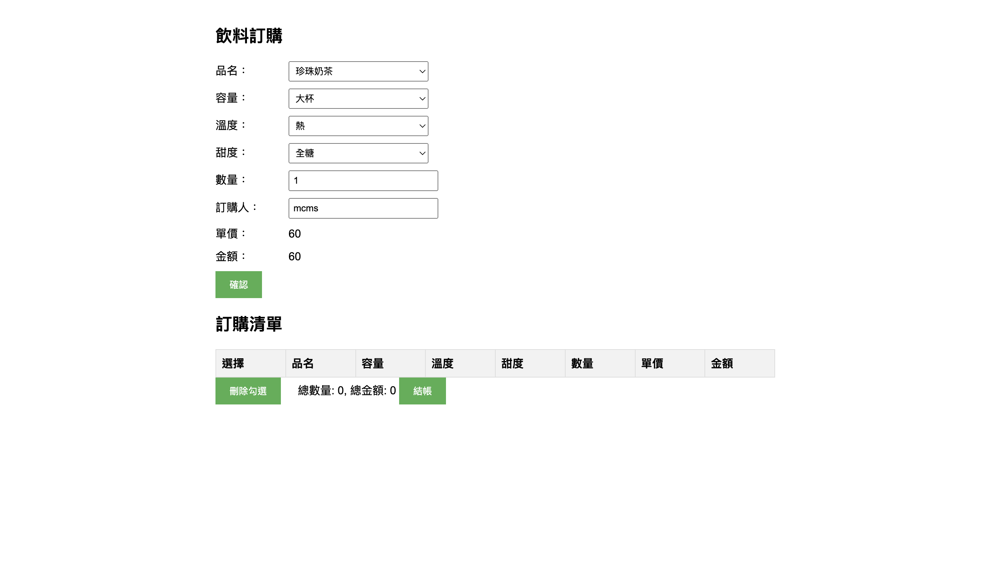
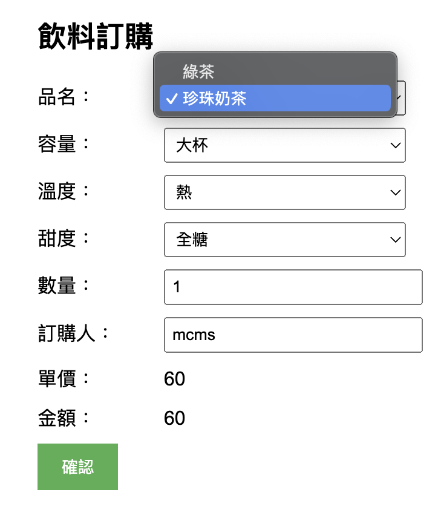
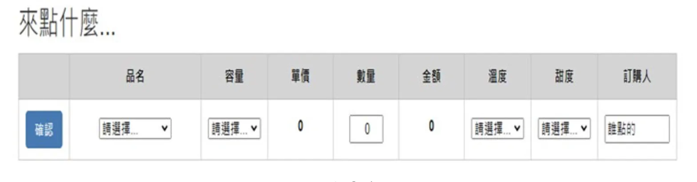
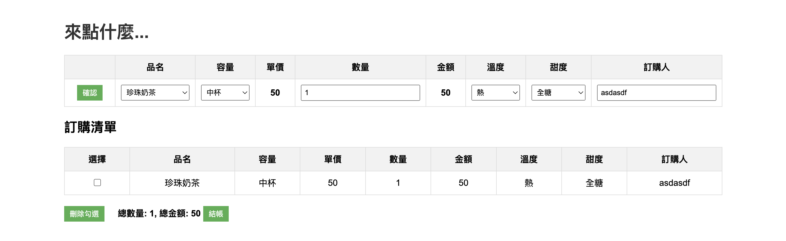

## Prompt 1
我直接把「飲料訂購系統.pdf」塞給claude
### 成果

bug: 飲料訂購那些資訊需要塞成一個橫排的表格，如pdf中圖3-1的表格，但他沒有做到

不算bug的bug: 題目會給一個csv，但我沒有丟csv給claude，所以他在js那邊模擬了一個csv，很有想法 

## Prompt 2
按照成果1的bug去修，我丟給他以下截圖給的Prompt為「我希望飲料訂購部分的排版跟這個一樣，並重新給我完整的html5,css,js檔案」

### 成果
基本就完成所有需求ㄌ

