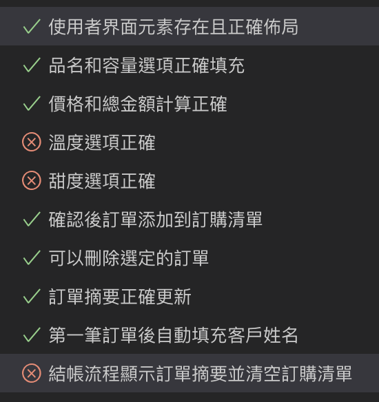

## P0 Prompt 0
我直接把「飲料訂購系統.pdf」塞給claude
### 成果

bug: 飲料訂購那些資訊需要塞成一個橫排的表格，如pdf中圖3-1的表格，但他沒有做到

不算bug的bug: 題目會給一個csv，但我沒有丟csv給claude，所以他在js那邊模擬了一個csv，很有想法 

## P0 Prompt 1
按照成果1的bug去修，我丟給他以下截圖給的Prompt為「我希望飲料訂購部分的排版跟這個一樣，並重新給我完整的html5,css,js檔案」

### 成果
基本就完成所有需求ㄌ

### p1 Prompt
因為playwright他需要data-testid還有aria-label，所以重新叫Claude生了html5,css,js三個檔案，Prompt為「我想要把部分物件都加上data-testid、aria-label屬性，請重新幫我生出html5,css,js」

### 成果
跟上一個成果沒什麼不一樣

### p2 Prompt 0
我把「html5,css,js」丟給Claude，並且給他這樣的Prompt:「現在要用playwright進行端對端測試，針對每一個需求進行最詳盡的測試並且給我，預設使用typerscript 去生成playwright腳本，對於每個測試腳本要註解是測試的需求是哪個，並且盡量用data-testid和aria-label去做selector，給我完整的測試腳本」

### 成果
Claude給了這些測試腳本，有些部分測試會是爛掉的，像是「溫度選項正確」、「甜度選項正確」、「結帳流程」，因此我讓Claude一個一個慢慢改

### p2 Prompt 1 (修改「溫度選項正確」)
Prompt:「溫度選項正確這一個測試是錯的，我要好好的打開combobox，去看裡面的東西是不是為visible的，請幫我修改這個測試」

### 成果
「溫度選項正確」是對的

### p2 Prompt 2(修改「甜度選項正確」)
Prompt:「甜度選項正確這一個測試是錯的，我要好好的打開combobox，去看裡面的東西是不是為visible的，請幫我修改這個測試」

### 成果
「甜度選項正確」是錯的，他根本沒有好好的打開combobox接著check裡面的東西

### p2 Prompt 3(修改「甜度選項正確」)
在check visible的時候出現問題，請麻煩改正它

### 成果
「溫度選項正確」是對的

### p2 Prompt 4修改「結帳流程顯示訂單摘要並清空訂購清單」
最後一個測試：「結帳流程顯示訂單摘要並清空訂購清單」也是錯的，在checkoutButton.click時出了問題，請修他

### 成果
「結帳流程顯示訂單摘要並清空訂購清單」對了，可喜可賀
